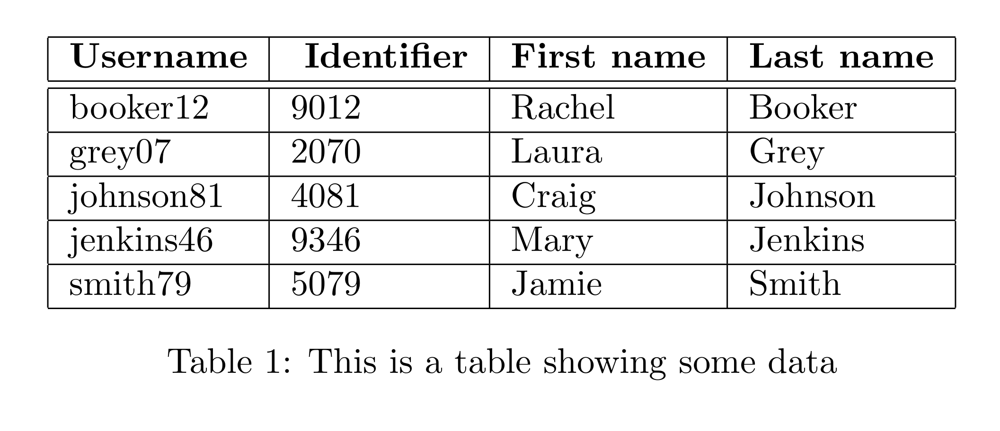
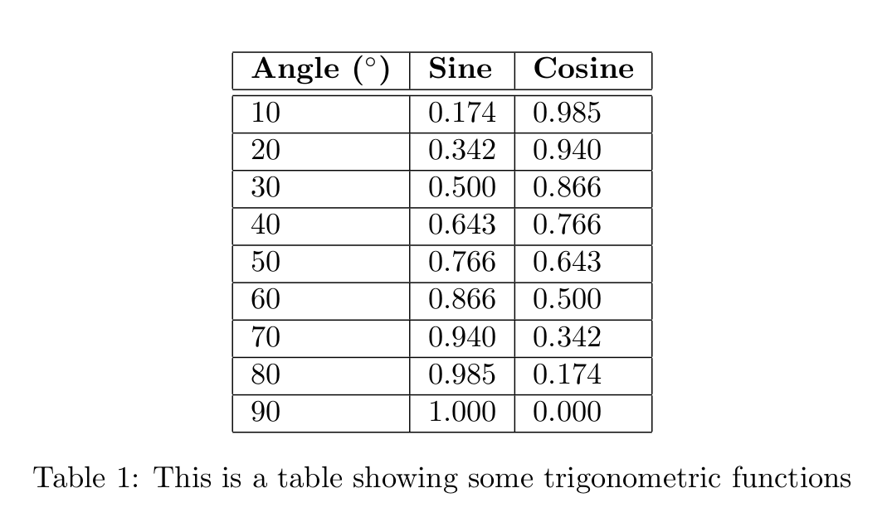
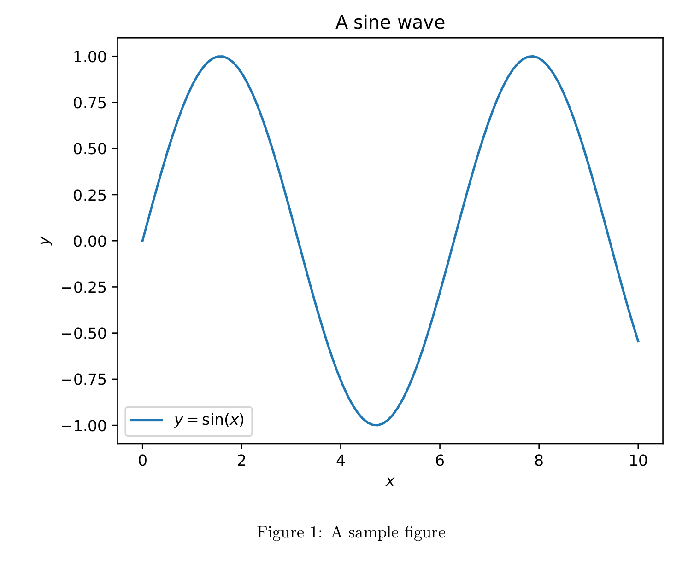

# LaPyX

LaPyX is a Python library which acts as a preprocessor for LaTeX. It allows for embedding Python code inside LaTeX documents, rendering the output as though it were part of the host document.

---

**Note that LaPyX runs unsanitised Python code on your computer!** Treat any LaPyX file as though you were running Python; if you didn't write it, read it carefully before compiling.

---

## Requirements

LaPyX relies on the following Python packages:
 - `pandas` - for reading `.csv` files and to accept a `pandas.DataFrame` as input to the `Table` class
 - `numpy` - to accept a `numpy.ndarray` as input to the `Table` class
- `matplotlib` - for most `Figure` class methods

It is also assumed that you have installed a LaTeX compiler and that this compiler is accessible as `pdflatex` from the command line.

## Usage

### Including Python in your LaTeX Documents

LaPyX is a preprocessor for LaTeX, so it does not require any changes to the LaTeX document itself. If an ordinary LaTeX document is passed to LaPyX it will be passed to the pdflatex compiler completely unchanged.

Python code can be embedded into a LaTeX document in one of two ways: enclosed in a `\py{...}` macro, or in a `python` environment. The former is used for inline code and cannot contain newlines; for short multi-line statements, use semi-colons to separate statements as normal in Python. The `python` environment can contain newlines and indentation, and is used for longer blocks of code.

Both the `\py{...}` macro and the `python` environment will be replaced by the output of their contents before compilation, so the LaTeX compiler will see no difference compared to a normal LaTeX document.

#### Examples

<div class = "sidebyside">

```latex
\py{from numpy.random import randint}
I rolled 2d6 and got \py{randint(1, 7) + radnint(1, 7)}.
```

<p class="latex">
I rolled 2d6 and got 4.
</p>
</div>

<div class="sidebyside">

```latex
\begin{python}
    from numpy.random import randint as rnd
    r1, r2 = rnd(1, 7), rnd(1, 7)
    total = r1 + r2
    line = f"I rolled 2d6 and got {total}."
    export(line)
\end{python}
```
<p class="latex">
I rolled 2d6 and got 8.
</p>
</div>

The second example uses the `export` function. This function should be called on any output you wish to see in the compiled document. It can be called multiple times, and the output will be concatenated in the order it is called. If the final line of a `python` environment (or of a `\py{...}` macro, using `;` delimiters) is not a call to `export` and is not an assignment (`a = b`), then it will automatically be passed to `export`, as in the first example. This can be suppressed by ending the line with a semicolon.

Additionally, the function `no_export()` can be called at any point to suppress all output until the end of the current Python block. This can be useful for debugging, or for importing modules which print to the console.

### The `Table` class

LaPyX includes a class which can help to make tables in LaTeX less of a headache. It's automatically imported at the start of each LaPyX document, so it's available for use immediately. See the more documentation for more detail and more in-depth examples.

#### Examples

<div class="sidebyside">

```latex
\begin{python}
    t = Table("some_data.csv")
    t.set_caption("This is a table showing some data")
    t.set_label("tab:sample")
    t.set_header_format(r"\bfseries")
    export(t)
\end{python}
```


</div>

<div class="sidebyside">

```latex
\begin{python}
    t = Table()
    x = np.array([(i + 1) * 10 for i in range(9)])
    t.add_column(x)
    t.add_column(np.sin(x * np.pi / 180))
    t.add_column(np.cos(x * np.pi / 180))
    t.set_headers(["Angle ($^\\circ$)", "Sine", "Cosine"])
    t.set_format([".0f", ".3f", ".3f"])
    t.set_caption("This is a table showing some trigonometric functions")
    t.set_label("tab:trig")
    t.set_header_format(r"\bfseries")
    t   
\end{python}
```

</div>

### The `Figure` class

In addition to tables, LaPyX includes a class for making figures. The constructor can be called with a filename, a `matplotlib.figure.Figure` object, or no argument in which case either the currently active `matplotlib.figure.Figure` is used or a new one is created. The `matplotlib` figure can then be interacted with as normal, and exported using the `export` function.

#### Examples

<div class="sidebyside">

```latex
\begin{python}
    fig = Figure()
    x = np.linspace(0, 10, 100)
    y = np.sin(x)
    fig.plot(x, y, label = "$y = \\sin(x)$")
    fig.xlabel("$x$")
    fig.ylabel("$y$")
    fig.title("A sine wave")
    fig.legend()
    fig.set_caption("A sample figure")
    fig.set_label("fig:sample")
    fig.set_width("0.75\\linewidth")
    export(fig)
\end{python}
```


</div>

### Compiling LaPyX Documents

To compile a LaPyX document, simply pass the file as a parameter to the `lapyx` script:

```bash
python3 -m lapyx my_document.tex
```

Unless an error occurs, this will produce a file called `my_document.pdf` in the same directory as the input file, with no auxillary files remaining. LaPyX takes several command line arguments, which can be viewed by running `python3 -m lapyx --help`.

- `-C`, `--no-compile` (no argument, default `False`): Do not compile the intermediary LaTeX file. This is useful if you want to inspect the intermediary file, or if you want to compile it yourself with a different compiler.
- `-o <file_path>`, `--output <file_path>`: Specify the output file path for the compiled PDF. If not specified, the output file will be named the same as the input file, but with the extension `.pdf`. If the specified file path does not end `.pdf`, it will be appended automatically.
- `-t <temp_dir>`, `--temp <temp_dir>`: Specify the directory to use for temporary files. If not specified, the default is to use the current directory. If the specified directory does not exist, it will be created automatically.
- `-d`, `--debug` (no argument, default `False`): No files will be deleted; all temporary files or directories created by LaPyX will be kept, and all auxillary files created by the LaTeX compiler will be kept.
- `-c <opts>`, `--compiler-options <opts>`: Additional options to be passed to the LaTeX compiler (pdflatex), which should be a string. Default is empty. `-interaction=nonstopmode` is always passed to the compiler, so this option should not be used to specify this option.
- `-k`, `--keep-figures` (no argument, default `False`): Do not delete the figures created by the `Figure` class. By default, any figures created by LaPyX will be deleted after compilation (except pre-existing figures passed as a file path to `Figure`).

Any command line arguments should precede the input file path.
